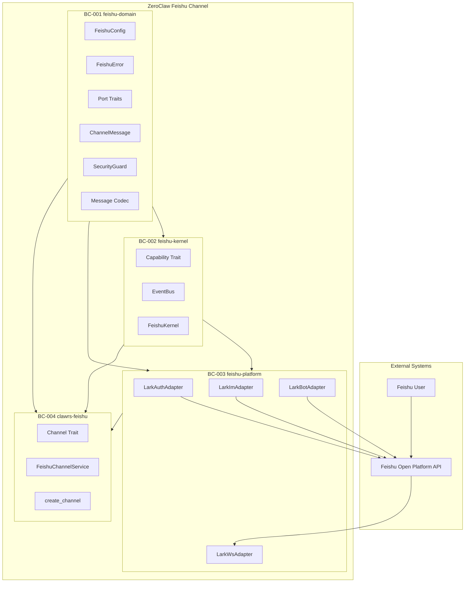
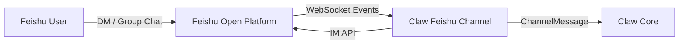
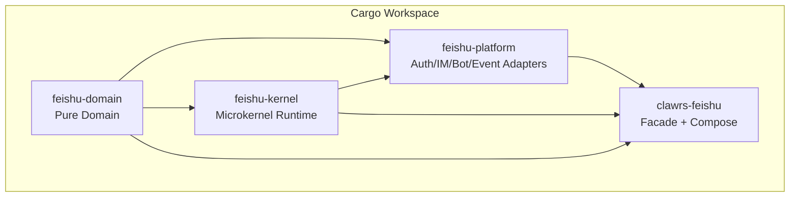
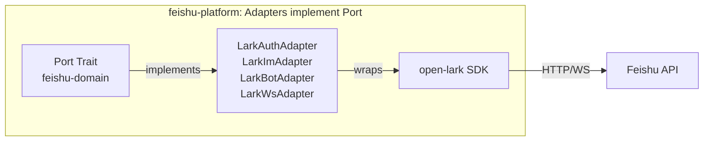
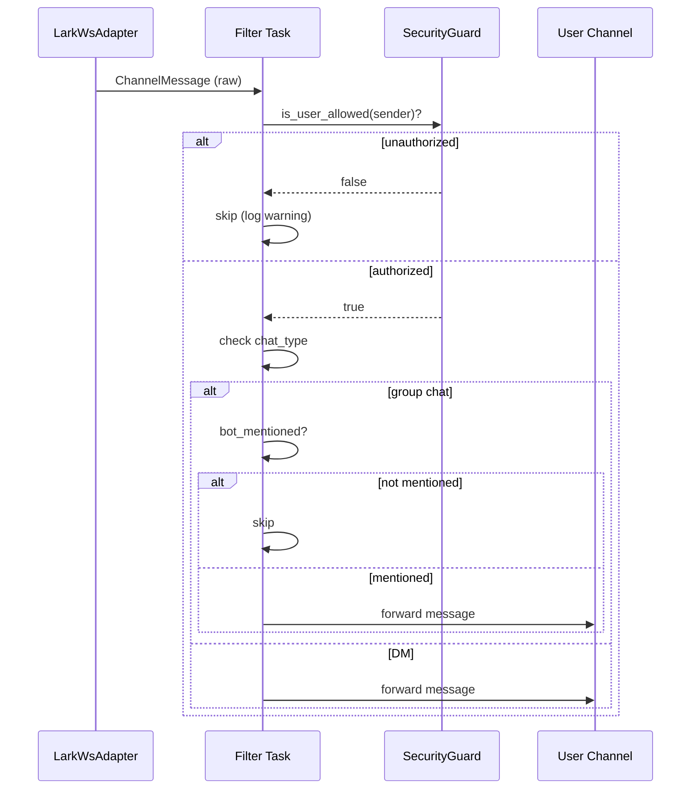

# Claw Feishu Channel -- Design Specification

> **C4 宏观导航 × DDD 中观划分 × 六边形微观落地**
> 本文档从已实现的 4-crate 架构反向工程生成，覆盖需求分析 → 架构设计 → 限界上下文落地 → 验收的全生命周期。

| C4 层级 | DDD 概念 | 六边形架构 | 核心职责 |
|---------|----------|-----------|---------|
| L1 System Context | Domain / Sub-domain | 系统边界与外部依赖 | Claw ↔ Feishu Open Platform |
| L2 Container | Bounded Context | 独立部署单元 | 4 Rust crates (Cargo workspace) |
| L3 Component | Aggregate / Service | Adapter + Port + Domain | 各 crate 内部六边形结构 |
| L4 Code | Entity / Value Object | Domain Model | ChannelMessage, FeishuConfig, SecurityGuard |

---

## Phase 1: 需求输入

### 1. 提案与目标

**背景与问题**：ZeroClaw 多通道 AI 助手需要对接飞书（Feishu/Lark）平台，实现双向消息通信。现有方案缺乏独立编译、可插拔替换的通道实现。

**价值主张**：
- 业务价值：扩展 ZeroClaw 触达飞书生态 1000+ 万企业用户
- 技术价值：4-crate 微内核架构，feishu-platform 内聚 Auth/IM/Bot/Event 适配器
- 团队价值：清晰的限界上下文边界，降低新人上手成本

**范围与成功标准**：
- 独立编译、零依赖 ZeroClaw 主项目
- 支持 WebSocket 长连接实时消息接收
- 支持 IM API 消息发送
- 安全白名单过滤 + 群聊 @mention 检测

**核心域提炼**：
- 核心子域：消息通道（Channel）—— 消息收发与过滤
- 支撑子域：认证（Auth）、Bot 身份（Bot Identity）
- 通用子域：安全守卫（Security Guard）、消息编解码（Codec）

### 2. 用户与场景

- **Persona-001**：ZeroClaw 开发者 —— 集成飞书通道到 AI 助手
- **Persona-002**：飞书终端用户 —— 通过飞书 DM/群聊与 AI 交互
- **Persona-003**：运维人员 —— 监控通道健康、管理白名单

**主要业务场景**：
- Scene-001：用户在飞书发送消息 → Bot 接收并回复
- Scene-002：管理员配置白名单 → 仅授权用户可交互
- Scene-003：群聊中 @Bot → 触发 AI 响应（非 @Bot 消息忽略）
- Scene-004：WebSocket 断线 → 自动指数退避重连

### 3. 非功能需求（NFR）

| 编号 | 类别 | 目标 | 度量 |
|------|------|------|------|
| NFR-001 | 性能 | 消息端到端延迟 | < 3000ms (API RT) |
| NFR-002 | 可用性 | WebSocket 自动重连 | 最多 10 次指数退避 |
| NFR-003 | 安全 | 凭证零硬编码 | env var 注入，.gitignore 覆盖 |
| NFR-004 | 可观测性 | 结构化日志 | tracing crate 全覆盖 |
| NFR-005 | 可扩展性 | 适配器内聚于 platform | 4-crate 架构，简化依赖 |
| NFR-006 | 可测试性 | 单元测试覆盖 | 33+ unit tests, fake port 注入 |

### 4. ASR 提炼

| ASR 编号 | 关联 NFR | 场景 | 优先级 |
|----------|----------|------|--------|
| ASR-001 | NFR-005 | feishu-platform 内模块可替换 | H |
| ASR-002 | NFR-002 | WebSocket 断线后 2^n 秒退避重连 | H |
| ASR-003 | NFR-003 | 源码中零硬编码凭证 | H |
| ASR-004 | NFR-001 | Feishu API 响应 < 3s | M |
| ASR-005 | NFR-006 | 所有端口可 fake 替换测试 | H |

---

## Phase 2: 架构设计

### 5. 领域与上下文（DDD 战略设计）

**限界上下文列表**：

| 编号 | 上下文 | Crate | 类型 |
|------|--------|-------|------|
| BC-001 | 领域层 (Domain) | `feishu-domain` | 核心域 |
| BC-002 | 微内核 (Kernel) | `feishu-kernel` | 核心域 |
| BC-003 | 平台适配 (Platform) | `feishu-platform` | 支撑域 |
| BC-004 | 门面/组合根 (Facade) | `clawrs-feishu` | 应用层 |

**上下文关系**：

| 编号 | 上游 | 下游 | 模式 |
|------|------|------|------|
| Rel-001 | BC-001 (domain) | BC-002 (kernel) | Shared Kernel |
| Rel-002 | BC-001 (domain) | BC-003 (platform) | Open Host Service |
| Rel-003 | BC-002 (kernel) | BC-003 (platform) | Customer-Supplier |
| Rel-004 | BC-003 (platform) | BC-004 (facade) | Conformist |
| Rel-005 | Feishu Open Platform | BC-003 (platform) | ACL (Anti-Corruption Layer) |



### 6. 架构决策与策略

**架构原则**：
- 依赖倒置（DIP）：适配器依赖领域层 Port trait，不反向
- 内聚原则：适配器集中于 feishu-platform，简化依赖图
- 意图揭示：Port trait 命名反映业务意图，非技术细节

**架构风格**：微内核架构 + 六边形架构 + DDD 战术模式

**全局错误码体系**：

| 范围 | 类别 | 示例 |
|------|------|------|
| E-FEISHU-1xxx | Auth | 1001 token fetch, 1002 token refresh |
| E-FEISHU-2xxx | Connection | 2001 WS connect, 2002 WS disconnect |
| E-FEISHU-3xxx | Message | 3001 send failed, 3002 decode failed |
| E-FEISHU-4xxx | Security | 4001 unauthorized, 4002 webhook sig |
| E-FEISHU-45xx | Bot | 4501 bot info fetch failed |
| E-FEISHU-5xxx | Capability | 5001 start failed, 5002 not found |

**架构决策记录（ADR）**：

| ADR 编号 | 关联 ASR | 决策 | 备选方案 | 取舍理由 |
|----------|----------|------|----------|----------|
| ADR-001 | ASR-001 | 4-crate 架构 (feishu-platform 合并适配器) | 7-crate 细粒度 | 编译速度 + 简化依赖 |
| ADR-002 | ASR-002 | open-lark SDK + 外层重连循环 | 自研 WebSocket 客户端 | 减少轮子，SDK 内部已有心跳 |
| ADR-003 | ASR-003 | env var 注入 + #[ignore] live tests | Feature flag gate | 简单有效，CI 友好 |
| ADR-004 | ASR-005 | Port trait + Arc\<dyn Port\> DI | Generic type params | 动态分发便于 fake 替换 |
| ADR-005 | ASR-002 | 专用 OS thread for WS (!Send) | unsafe impl Send | 安全性 > 性能 |

### 7. 架构与组件（C4 视图）

**L1 System Context**:



**L2 Container (4 Crates)**:



**L3 Component (Hexagonal in feishu-platform)**:



**技术栈**：

| 技术 | 版本 | 用途 |
|------|------|------|
| Rust | 2021 edition | 系统语言 |
| tokio | 1.42 | 异步运行时 |
| open-lark | 0.14 | 飞书 SDK |
| serde / serde_json | 1.0 | 序列化 |
| thiserror | 2.0 | 错误派生 |
| tracing | 0.1 | 结构化日志 |
| async-trait | 0.1 | 异步 trait |
| Bruno | 3.x | E2E API 测试 |

### 8. 架构评审检查点

| NFR 编号 | ASR 编号 | ADR 编号 | 覆盖状态 | 备注 |
|----------|----------|----------|----------|------|
| NFR-001 | ASR-004 | ADR-002 | ✅ | open-lark SDK, e2e 性能测试验证 |
| NFR-002 | ASR-002 | ADR-002, ADR-005 | ✅ | 指数退避 + OS thread 隔离 |
| NFR-003 | ASR-003 | ADR-003 | ✅ | env var + .gitignore + SECURITY.md |
| NFR-004 | - | - | ✅ | tracing crate 全覆盖 |
| NFR-005 | ASR-001 | ADR-001 | ✅ | 4-crate 架构，feishu-platform 内聚 |
| NFR-006 | ASR-005 | ADR-004 | ✅ | 33 unit tests, fake port DI |

**已知技术债**：
- Webhook 模式尚未实现（仅 WebSocket）
- 消息类型仅支持 text，富文本/卡片待扩展

**已落实**：GroupPolicy 已在 `channel::filter::should_forward_message` 中通过 `SecurityGuard::is_group_allowed` 强制执行。

---

## Phase 3: 限界上下文详细设计

### 9. BC-001 feishu-domain -- 领域层

**职责边界**：纯领域类型，零基础设施依赖。定义整个飞书通道的共享词汇表。

**模块结构**：

| 模块 | 内容 | 职责 |
|------|------|------|
| `config` | FeishuConfig, FeishuDomain, FeishuConnectionMode | 配置值对象 |
| `error` | FeishuError (E-FEISHU-xxxx) | 领域错误枚举 |
| `model/message` | ChannelMessage | 通道消息值对象 |
| `model/event` | FeishuEventEnvelope, FeishuMessageEvent | 飞书事件值对象 |
| `security/guard` | SecurityGuard | 白名单安全守卫 |
| `security/policy` | DmPolicy, GroupPolicy | 安全策略值对象 |
| `port/auth` | AuthPort trait | 认证驱动端口 |
| `port/bot` | BotInfoPort trait | Bot 身份驱动端口 |
| `port/im` | MessageSenderPort trait | IM 消息发送驱动端口 |
| `port/event` | EventListenerPort trait | 事件监听驱动端口 |
| `codec` | decode/encode/strip_mentions | 消息编解码领域服务 |

### 10. BC-002 feishu-kernel -- 微内核

**职责边界**：微内核运行时，管理 Capability 生命周期和 EventBus。

| 模块 | 内容 | 职责 |
|------|------|------|
| `capability` | Capability trait | 插件契约（start/stop/health_check）|
| `event_bus` | EventBus, FeishuEvent | 广播式能力间通信 |
| `kernel` | FeishuKernel | 注册、启动、停止、聚合健康检查 |

### 11. BC-003 feishu-platform -- 平台适配器

| 模块 | Port | Adapter | SDK Feature |
|------|------|---------|-------------|
| `auth` | AuthPort | LarkAuthAdapter | `authentication` |
| `im` | MessageSenderPort | LarkImAdapter | `im` |
| `bot` | BotInfoPort | LarkBotAdapter | `bot` |
| `event` | EventListenerPort | LarkWsAdapter | `websocket` |

### 12. BC-004 clawrs-feishu -- 门面/组合根

**模块结构**：

| 文件 | 内容 | 职责 |
|------|------|------|
| `channel.rs` | Channel trait + FeishuChannelService | 驱动端口 + 聚合根 |
| `compose.rs` | create_channel() | 依赖注入组装 |
| `capability.rs` | AuthCapability, BotCapability, ImCapability | Port → Capability 桥接 |

**OpenClaw 兼容配置**（FeishuConfig）:
- `dm_policy`: pairing | open | deny
- `group_policy`: allowlist | open | deny
- `allow_from`: DM 白名单（覆盖 allowed_users）
- `group_allow_from`: 群聊白名单
- `group_require_mention`: 群聊是否要求 @mention（默认 true）

**listen() 消息过滤流**：



---

## Phase 4: 运维与验收

### 13. 异常与恢复

| 错误码 | 场景 | 恢复策略 |
|--------|------|----------|
| E-FEISHU-1001 | Token 获取失败 | 重试 + 检查 App 凭证 |
| E-FEISHU-2001 | WebSocket 连接失败 | 指数退避重连 (2^n, max 10 次) |
| E-FEISHU-3001 | 消息发送失败 | 上层重试或降级 |
| E-FEISHU-4001 | 未授权用户 | 日志告警，消息丢弃 |
| E-FEISHU-5001 | Capability 启动失败 | 阻止整体启动，快速失败 |

### 14. 部署流程

```bash
# 环境准备
cp e2e/.env.example e2e/.env
# 填写 FEISHU_APP_ID, FEISHU_APP_SECRET 等

# 构建
cargo build --workspace

# 单元测试
cargo test --workspace

# Live API 测试（需真实凭证）
FEISHU_APP_ID=xxx FEISHU_APP_SECRET=yyy \
  cargo test -p clawrs-feishu --test live_api_test -- --ignored

# E2E 测试
cd e2e && bash run-tests.sh api

# 发送测试消息
FEISHU_APP_ID=xxx FEISHU_APP_SECRET=yyy FEISHU_CHAT_ID=oc_xxx \
  cargo run --example send_message
```

### 15. 示例与样本

**create_channel API**：

```rust
use clawrs_feishu::{create_channel, Channel, FeishuConfig, FeishuDomain};

let config = FeishuConfig {
    app_id: std::env::var("FEISHU_APP_ID").unwrap(),
    app_secret: std::env::var("FEISHU_APP_SECRET").unwrap(),
    domain: FeishuDomain::Feishu,
    ..Default::default() // requires Default impl or fill all fields
};

let channel = create_channel(config);
channel.send("Hello!", "oc_chat_id").await?;
```

**listen + filter**：

```rust
let (tx, mut rx) = tokio::sync::mpsc::channel(256);
tokio::spawn(async move {
    channel.listen(tx).await.unwrap();
});

while let Some(msg) = rx.recv().await {
    println!("From {}: {}", msg.sender, msg.content);
}
```
