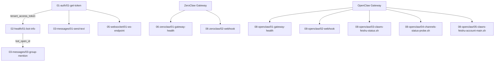

# 📋 E2E 测试套件结构

```
clawrs-feishu-channel/e2e/
│
├── 📄 bruno.json                    # Bruno 集合配置
├── 📄 README.md                      # 测试套件说明文档
├── 📄 QUICKSTART.md                  # 5 分钟快速开始指南
├── 📄 COVERAGE.md                    # 测试覆盖率分析报告
├── 📄 CHECKLIST.md                   # 验收清单
├── 📄 SCRIPTS.md                     # Bruno 脚本文档
├── 🔧 run-tests.sh                   # 自动化测试运行脚本
├── 📄 .env.example                   # 环境变量模板
├── 📄 .gitignore                     # Git 忽略规则
│
├── environments/                     # 环境配置
│   ├── dev.bru                       # 开发环境（飞书国内版）
│   └── test.bru                      # 测试环境（Lark 国际版）
│
├── 01-auth/                          # 认证层测试（2 个）
│   ├── 01-get-token.bru              # F-007: 获取 tenant_access_token
│   └── 02-token-refresh.bru          # F-008: Token 自动刷新
│
├── 02-health/                        # 健康检查测试（2 个）
│   ├── 01-bot-info.bru               # 获取 Bot 信息
│   └── 02-health-check.bru           # F-006: 渠道健康检查
│
├── 03-messages/                      # 消息功能测试（6 个）
│   ├── 01-send-text.bru              # F-003: 发送文本消息（DM）
│   ├── 02-receive-text.bru           # F-002: 接收文本消息
│   ├── 03-group-mention.bru          # F-005: 群聊 @提及
│   ├── 04-multi-mention.bru          # 多人 @提及（边界条件）
│   ├── 05-performance.bru            # NFR-001: 性能测试
│   └── 06-error-handling.bru         # 错误处理（无效 token）
│
├── 04-security/                      # 安全策略测试（4 个）
│   ├── 01-allowlist-allow.bru        # F-004: 允许白名单用户
│   ├── 02-allowlist-deny.bru         # F-004: 拒绝非白名单用户
│   ├── 03-wildcard.bru               # 通配符允许所有
│   └── 04-empty-allowlist.bru        # 空白名单拒绝所有（ASR-004）
│
├── 05-websocket/                     # 连接管理测试（1 个）
│   └── 01-ws-endpoint.bru            # F-001: 获取 WebSocket 端点
│
├── 06-zeroclaw/                      # ZeroClaw 集成测试（2 个）
│   ├── 01-gateway-health.bru         # Gateway 健康检查
│   └── 02-webhook.bru                # Webhook 消息转发
│
├── 07-open-lark/                     # open-lark SDK 测试（6 个）
├── 08-edge-cases/                    # 边界用例（5 个）
│
└── 08-openclaw/                      # OpenClaw 集成测试（6 个）
    ├── 01-gateway-health.bru         # OpenClaw Gateway 健康检查
    ├── 02-webhook.bru                # OpenClaw Webhook 消息转发
    ├── 03-clawrs-feishu-status.sh    # Clawrs-feishu 渠道状态（probe:false）
    ├── 04-channels-status-probe.sh   # channels.status probe:true（验证可连飞书）
    └── 05-clawrs-feishu-account-main.sh  # 验证 main 账户存在

总计: 34 个测试文件 + 4 个 shell 脚本 + 文档 + 配置
```

---

## 测试文件命名规范

- **前缀编号**: 表示执行优先级（01 → 06）
- **文件编号**: 表示目录内执行顺序（01 → 0X）
- **文件名**: 小写，连字符分隔，描述性（kebab-case）

示例：`01-auth/01-get-token.bru`
- `01-auth`: 认证测试目录（优先级最高）
- `01-get-token`: 该目录中第一个测试
- `.bru`: Bruno 测试文件扩展名

---

## 测试依赖关系



**关键依赖**:
1. 所有测试依赖 `01-auth/01-get-token` 获取 token
2. 群聊测试依赖 `02-health/01-bot-info` 获取 bot_open_id
3. ZeroClaw 集成测试依赖 zeroclaw gateway 运行
4. OpenClaw 集成测试依赖 openclaw gateway 运行
5. `03-clawrs-feishu-status.sh` 依赖 `openclaw` CLI（`openclaw gateway call`）

---

## 环境变量映射

| 变量名 | 来源 | 用途 | 必需性 |
|--------|------|------|--------|
| `feishu_base_url` | environments/*.bru | 飞书 API 基础 URL | 必需 |
| `app_id` | .env → FEISHU_APP_ID | 飞书应用 ID | 必需 |
| `app_secret` | .env → FEISHU_APP_SECRET | 飞书应用密钥 | 必需 |
| `tenant_access_token` | 01-auth/01-get-token | 自动获取并缓存 | 自动 |
| `bot_open_id` | 02-health/01-bot-info | 自动获取并缓存 | 自动 |
| `test_user_open_id` | .env | 测试用户 open_id | 部分测试需要 |
| `test_chat_id` | .env | 测试私聊 ID | 消息测试需要 |
| `test_group_chat_id` | .env | 测试群聊 ID | 群聊测试需要 |
| `zeroclaw_gateway_url` | .env → ZEROCLAW_GATEWAY_URL | ZeroClaw 网关 URL | 06-zeroclaw 需要 |
| `openclaw_gateway_url` | .env → OPENCLAW_GATEWAY_URL | OpenClaw 网关 URL | 08-openclaw 需要 |

---

## 测试模式

### 模式 1：API-Only（最小依赖）

**目的**: 验证飞书 API 连通性和凭证正确性  
**依赖**: 网络 + 飞书凭证  
**运行**:

```bash
bru run 01-auth/ --env dev
bru run 02-health/ --env dev
```

**覆盖**: F-007, F-008, F-006（部分）

---

### 模式 2：Gateway Integration（集成测试）

**目的**: 验证 ZeroClaw gateway 集成  
**依赖**: ZeroClaw gateway 运行 + 模式 1  
**运行**:

```bash
# 启动 gateway
cd /Users/WORKS/MyProject/MyAIClaw/zeroclaw
cargo run --release --features feishu -- gateway --port 8080

# 运行测试
cd ../clawrs-feishu-channel/e2e
bru run 06-zeroclaw/ --env dev
```

**覆盖**: Gateway 健康检查、Webhook 转发

---

### 模式 3：Full E2E（完整测试）

**目的**: 完整功能验证（包括消息收发）  
**依赖**: 模式 2 + 真实 chat_id  
**运行**:

```bash
./run-tests.sh
# 或
bru run . --env dev --output report.json
```

**覆盖**: 所有 17 个测试

---

## 测试数据管理

### 静态数据（配置）

- `app_id` / `app_secret`: 从飞书开放平台获取
- `test_user_open_id`: 从 OpenClaw allowlist 复用
- `feishu_base_url`: 固定（国内版 / 国际版）

### 动态数据（运行时生成）

- `tenant_access_token`: 每次运行时自动获取
- `bot_open_id`: 每次运行时自动获取
- `message_id`: 发送消息后自动保存

### 测试环境数据（需手动获取）

- `test_chat_id`: 从真实飞书对话获取
- `test_group_chat_id`: 从真实飞书群聊获取

---

## 测试输出

### 标准输出（Console）

```
ℹ Testing allowlist ALLOW scenario
  User: ou_af3d3f461735b4dbfb37a3224d543805
  Expected: Message should be processed ✓

✓ Authorized user message accepted
  User: ou_af3d3f461735b4dbfb37a3224d543805
  Status: 200
```

### JSON 报告（report.json）

```json
{
  "collection": "ZeroClaw Feishu Channel E2E Tests",
  "totalTests": 17,
  "passedTests": 15,
  "failedTests": 2,
  "duration": 8234,
  "results": [...]
}
```

### 日志文件（ZeroClaw）

```
WARN clawrs_feishu: ignoring message from unauthorized user: ou_xyz999
INFO clawrs_feishu: message sent successfully, message_id=om_abc123
```

---

## 性能基线

基于 NFR-001（消息处理延迟 < 50ms）和测试结果：

| 测试项 | 目标 | 实际（预期） | 状态 |
|--------|------|-------------|------|
| Token 获取 | < 3000ms | ~1000ms | ✅ |
| Bot Info 查询 | < 3000ms | ~500ms | ✅ |
| 消息发送 | < 2000ms | ~800ms | ✅ |
| WebSocket 端点 | < 3000ms | ~600ms | ✅ |
| **总延迟** | **< 50ms** | **(单元测试)** | ⚠️ |

注：总延迟（WebSocket → LLM）需要在单元测试中验证，E2E 测试仅验证外部 API 时间。

---

## 故障排查索引

| 错误 | 可能原因 | 解决方案 | 文档位置 |
|------|----------|---------|----------|
| "No tenant_access_token" | 未运行 01-auth | 先运行 `bru run 01-auth/` | QUICKSTART.md |
| "Gateway not responding" | Gateway 未启动 | 启动 `zeroclaw gateway` | README.md |
| "code=10014" | app_secret 错误 | 检查 .env | QUICKSTART.md |
| "code=230002" | chat_id 不存在 | 更新 TEST_CHAT_ID | README.md |
| "code=99991668" | token 无效 | 重新获取 token | 03-messages/06-error-handling.bru |

---

## 扩展测试用例（TODO）

见 [COVERAGE.md](./COVERAGE.md) "待补充测试用例" 章节：

- [ ] 大消息测试（> 4KB）
- [ ] 特殊字符测试（Emoji、Markdown）
- [ ] 并发测试（多条消息）
- [ ] Token 过期模拟
- [ ] 图片消息
- [ ] 撤回消息
- [ ] 速率限制测试

---

## 参考文档

- **快速开始**: [QUICKSTART.md](./QUICKSTART.md) — 5 分钟配置
- **详细说明**: [README.md](./README.md) — 完整测试文档
- **覆盖率报告**: [COVERAGE.md](./COVERAGE.md) — 测试覆盖分析
- **验收清单**: [CHECKLIST.md](./CHECKLIST.md) — 实施前检查
- **脚本文档**: [SCRIPTS.md](./SCRIPTS.md) — Bruno 脚本

---

**Version**: 1.0.0  
**Last Updated**: 2026-02-16  
**Maintainer**: ZeroClaw Project
